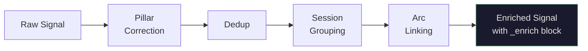
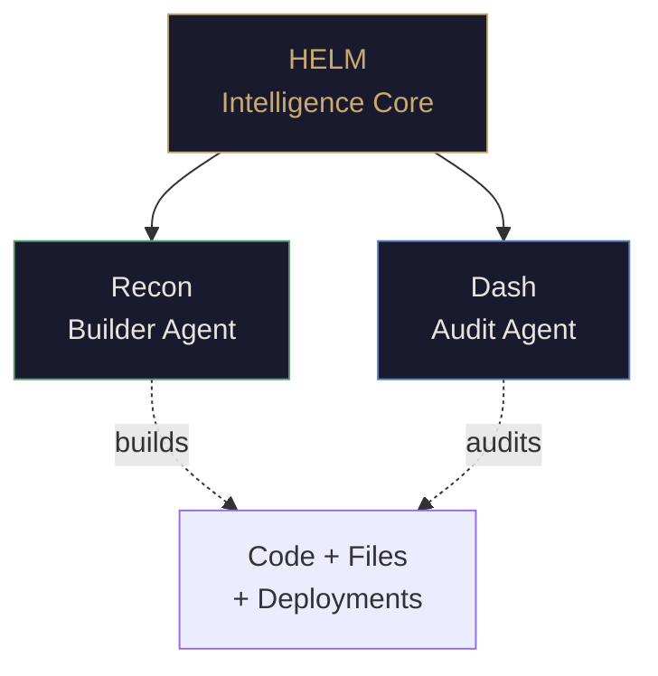
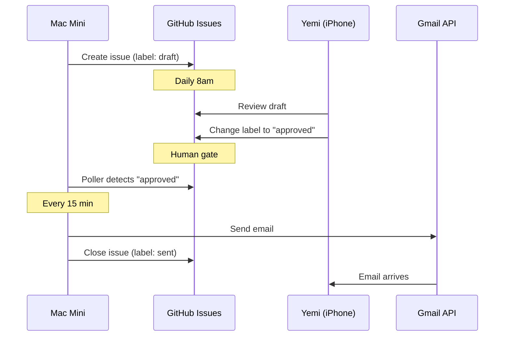
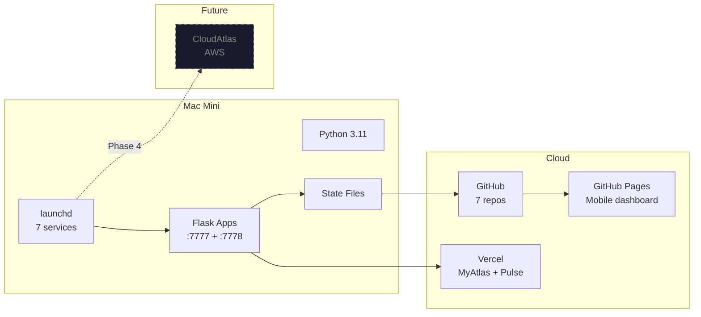

# Helm Architecture

> Every component exists for a reason. No bloat, no unnecessary dependencies.

---

## Signal Flow

The core pipeline: sources feed Capture, Capture feeds the enrichment chain, enriched data feeds every surface.

```mermaid
flowchart TD
    subgraph Sources
        GM[Gmail\nhelm@akembi.com]
        HC[HelmCapture\niPhone App]
        MN[Manual\nNotes + Photos]
    end

    subgraph Pipeline
        CAP[Helm Capture\nFlask :7777]
        ENR[Enrich\nDeterministic]
        SUG[Suggest\nPattern Match]
        DIG[Digest\nClaude Haiku AI]
    end

    subgraph State
        SIG[(signals.json)]
        ARC[(arcs.json)]
        BRG[(bridges.json)]
        CLR[(colours.json)]
    end

    subgraph Surfaces
        MA[MyAtlas\nWeb + Desktop]
        MOB[Mobile Dashboard\nGitHub Pages]
        OBX[Email Digest\nGitHub-Gated]
        PLS[Pulse\nDaily Cards]
    end

    GM --> CAP
    HC --> CAP
    MN --> CAP
    CAP --> ENR
    ENR --> SUG
    SUG --> DIG
    ENR --> SIG
    ENR --> ARC
    SUG --> BRG
    SUG --> CLR
    SIG --> MA
    SIG --> MOB
    CLR --> MOB
    ARC --> MOB
    DIG --> MA
    DIG --> OBX
    CLR --> PLS

    style CAP fill:#1a1a2e,stroke:#c8a96e,color:#e8e4dd
    style ENR fill:#1a1a2e,stroke:#5a9e6f,color:#e8e4dd
    style SUG fill:#1a1a2e,stroke:#5a7fbf,color:#e8e4dd
    style DIG fill:#1a1a2e,stroke:#8a6abf,color:#e8e4dd
    style MA fill:#1a1a2e,stroke:#c8a96e,color:#e8e4dd
    style MOB fill:#1a1a2e,stroke:#c8a96e,color:#e8e4dd
```

---

## Component Details

### Helm Capture — Signal Intake

| Property | Value |
|----------|-------|
| Port | `:7777` |
| Stack | Flask + Claude Vision API (Haiku) |
| Status | Always On (launchd) |
| Version | v0.5.0 |

**Endpoints:** `/analyse` `/save` `/mobile-save` `/signals` `/digest` `/feedback` `/stats` `/trips` `/ping` `/refresh`

The central nervous system. Receives all signals, triggers the 3-step pipeline on `/refresh` (Gmail -> Enrich -> Suggest), and serves the AI digest. The only component that talks to Claude API directly.

---

### Enrich Layer — Deterministic Intelligence



| Property | Value |
|----------|-------|
| Type | Deterministic — zero API cost |
| File | `helm_enrich.py` |
| Schema | `setdefault` pattern guarantees all fields |

Every signal gets a complete `_enrich` block: `original_pillar`, `corrected_pillar`, `cluster_id`, `group_id`, `group_label`, `group_size`, `arc_ids`. No sparse blocks, no missing fields.

**Layers deployed:**
- Layer 1: Deterministic enrichment (live)
- Layer 2: State persistence — arcs, bridges, colours (live)
- Layer 3: Feedback integration — user reactions feed back into enrichment (Q2)

---

### Suggest Engine — Pattern Matching

| Property | Value |
|----------|-------|
| Type | Pattern matching + bridge detection |
| File | `helm_suggest.py` |
| Output | `suggestions.json` |

Merges capture + gmail signals, maps categories to pillars, detects cross-pillar bridges, deduplicates events (by date/time/title), detects schedule conflicts, and generates actionable suggestions.

---

### Digest — AI Summary

| Property | Value |
|----------|-------|
| Model | Claude Haiku |
| Cost | ~$0.004 per call |
| Context | HELM.md profile + 30 signals + arcs + momentum |

The only AI-powered step in the pipeline. Reads your Helm profile, recent signals, arc context, and pillar momentum. Generates a natural language summary of what matters today.

---

## Agent Architecture



| Agent | Role | Protocol |
|-------|------|----------|
| **Helm** | Intelligence core — routes context, maintains state, strategic decisions | Orchestrator |
| **Recon** | Builder — code generation, deployment, pipeline construction | Research -> Plan -> Execute -> Report |
| **Dash** | Auditor — quality assurance, security review, confidence scoring | Threat surface + dependency chain analysis |

> Dash doesn't audit Recon to catch failures. Dash audits to strengthen what ships.

---

## Outbox System — GitHub-Gated Email



**Security model:** Recipient allowlist (hardcoded), GitHub approval gate, scope isolation, audit trail on every issue. Zero unsupervised outbound.

---

## State Layer

Persistent files in `~/Claude/logs/`:

| File | Content | Updated By |
|------|---------|-----------|
| `signals.json` | All captured signals | Capture |
| `arcs.json` | Active narrative arcs (6) | Enrich |
| `bridges.json` | Cross-pillar connections (10) | Suggest |
| `colours.json` | Pillar momentum + heat | Suggest |
| `suggestions.json` | Actionable recommendations | Suggest |

The memory layer. Survives restarts. Updated on every `/refresh` cycle. Read by Digest, MyAtlas, and the mobile dashboard.

---

## Infrastructure



### launchd Services

| Plist | Schedule | Function |
|-------|----------|----------|
| `com.helm.web` | Always On | Helm Capture Flask (:7777) |
| `com.helm.system` | Always On | Health dashboard (:7778) |
| `com.helm.gmail` | Hourly | Gmail inbox fetch |
| `com.helm.refresh` | Hourly | Full pipeline: Gmail -> Enrich -> Suggest |
| `com.helm.status.push` | Hourly | Push status JSON to GitHub |
| `com.helm.outbox.digest` | Daily 8am | Create email draft issue |
| `com.helm.outbox.poll` | Every 15 min | Send approved drafts |

---

## Future — CloudAtlas

The endgame. Helm Capture, Enrich, Suggest, Digest move to AWS. Mac Mini becomes optional. All endpoints reachable from anywhere.

```
Phase 1: IAM setup .............. In progress
Phase 2: RDS PostgreSQL ......... Planned
Phase 3: Mock scenarios ......... Planned
Phase 4: Helm integration ....... Planned
```

When CloudAtlas goes live, every mobile gap disappears. The pipeline is cloud-native, MyAtlas hits cloud endpoints, and the Mac Mini becomes a development machine instead of the production server.

---

<p align="center"><sub>Helm Intelligence &middot; A.KEMBI &middot; 2026</sub></p>
